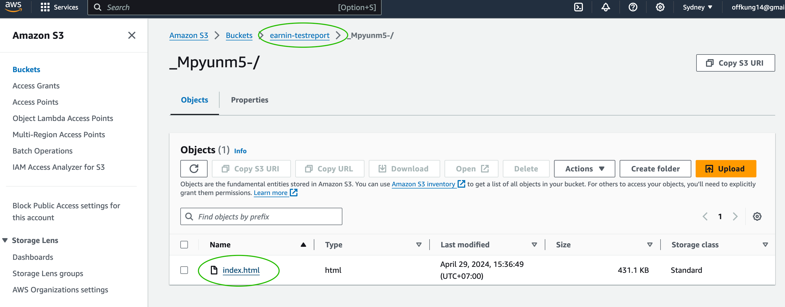

# EarnIn - Credit monitoring Assignment

End-to-end testing powered by [playwright](https://github.com/microsoft/playwright) with typescript

## Setup

### 0. Require Nodejs to setup this project

Recommended to use asdf-vm and plugin NodeJS. See more detail by this link [asdf-vm-nodejs](https://asdf-vm.com/guide/getting-started.html#install-the-plugin)
```
asdf install nodejs 21.6.2
```

### 1. Clone the project

```
git clone https://github.com/trustmeiamaqa/earnin-ci.git
```

### 2. install dependencies

```
npm install
npx playwright install
```

### 3. set up environment variables

Copy the environment variable from [1password](https://share.1password.com/s#OZgtKZdek2TQu2SscxiINj51B-KXj-jXL52XhSBuKM4)
and paste it into `.env` file on the project directory before run the test

### 4. Execute the playwright test

4.1 Navigations menu testing on Desktop Chrome browser
```
$ npm run e2e:desktop
```
4.2 Navigations menu testing on Mobile Safari browser
```
$ npm run e2e:mobile
```
4.3 Verify the ‘User viewed Screen’ analytics events
```
$ npm run e2e:screenshots
```
4.4 Snapshot comparison testing on Desktop Chrome and Mobile views page 
```
$ npm run e2e:screenshots
```
4.5 Run all regression test cases
```
$ npm run e2e:full
```
#### test results


### 5. Execute the test on Github actions CI
The test also supports github actions ci to run regression test cases, and also upload the artifact test report into the AWS S3 bucket by following link on activity log
5.1 Go to Actions -> run time jobs

5.2 Then check the jobs details

5.3 See the link to report

5.4 Confirm that the report has been uploaded into the AWS S3 bucket

5.5 How the test report looks like
e.g. https://earnin-testreport.s3.ap-southeast-2.amazonaws.com/F-f8KqtNI/index.html


## Test structures

### tests directory

keep all test cases which are separated by features, devices, including some test data specific for each test

```
tests
└── products
    ├── desktop-chrome
    │   ├── analytics-request.spec.ts
    │   ├── navigations-desktop.spec.ts
    │   ├── screenshots
    │   │   ├── about-us-page-darwin.png
    │   │   ├── careers-page-darwin.png
    │   │   ├── credit-monitoring-page-darwin.png
    │   │   ├── in-the-news-page-darwin.png
    │   │   └── our-impact-page-darwin.png
    │   └── snapshot-desktop.spec.ts
    └── mobile
        ├── navigations-mobile.spec.ts
        ├── screenshots
        │   ├── about-us-page-darwin.png
        │   ├── careers-page-darwin.png
        │   ├── credit-monitoring-page-darwin.png
        │   ├── in-the-news-page-darwin.png
        │   └── our-impact-page-darwin.png
        └── snapshot-mobile.spec.ts
```

### src directory
keep all the resource functions e.g. constants, components, pages (POM), utils

```
src
├── components
│   ├── NavigationBarDesktop.ts
│   ├── NavigationBarMobile.ts
│   └── PDPA.ts
├── constants
│   ├── analytics.ts
│   └── paths.ts
├── pages
│   ├── AboutUs.page.ts
│   ├── Careers.page.ts
│   ├── CreditMonitoring.page.ts
│   ├── InTheNews.page.ts
│   └── OurImpact.page.ts
└── utils
    └── interceptNetworkRequests.ts
```

### Githup actions Workflow
locating on .github directory and including pull request template, workflow files
```
.github
├── CODEOWNERS
├── pull_request_template.md
└── workflows
    └── playwright.yml
```

### npm scripts
Provide the shortcut commands for run test scripts, linter, prettier
```
"scripts": {
    "lint": "eslint --ext \"tests/**/*.{js,jsx,ts,tsx}\" \"src/**/*.{js,jsx,ts,tsx}\" ",
    "lint-fix": "eslint . --ext .ts --fix",
    "e2e:desktop": "npx playwright test --grep @desktop tests/products",
    "e2e:mobile": "npx playwright test --grep @mobile tests/products",
    "e2e:screenshots": "npx playwright test --grep @screenshot tests/products",
    "e2e:full": "npx playwright test tests/products",
    "e2e:ci": "npx playwright test --grep @ci tests/products",
    "e2e:update-screenshot": "npx playwright test --grep @screenshot tests/products --update-snapshots",
    "e2e:report": "npx playwright show-report"
  },
```

### Known issues
1. The screenshot comparison test case remains flaky and unreliable on certain pages, especially those with lengthy content and image animations, such as the 'In the News' navigation page and the 'Careers' page.
2. There are issues preventing the execution of the screenshot comparison test case on GitHub Actions CI. These include:
2.1. The quality of the actual screenshots on Linux is lower than expected when compared to the screenshot files on macOS. A proposed solution is to utilize Docker containers to ensure consistent environments.
2.2. The extension naming convention differs between macOS and GitHub Actions CI (Ubuntu), with '-darwin.png' used on macOS and '-linux.png' used on GitHub Actions CI.